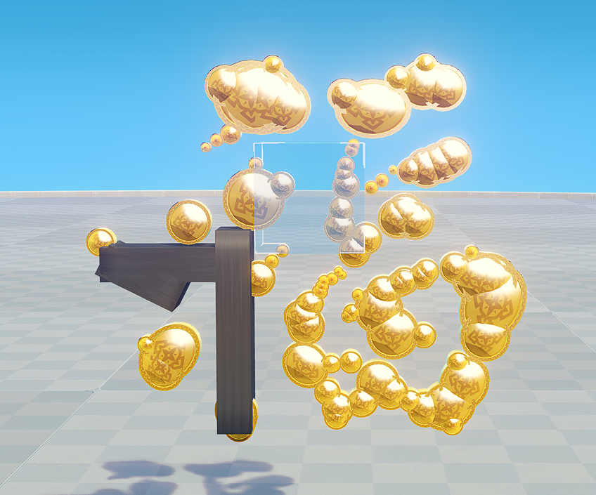
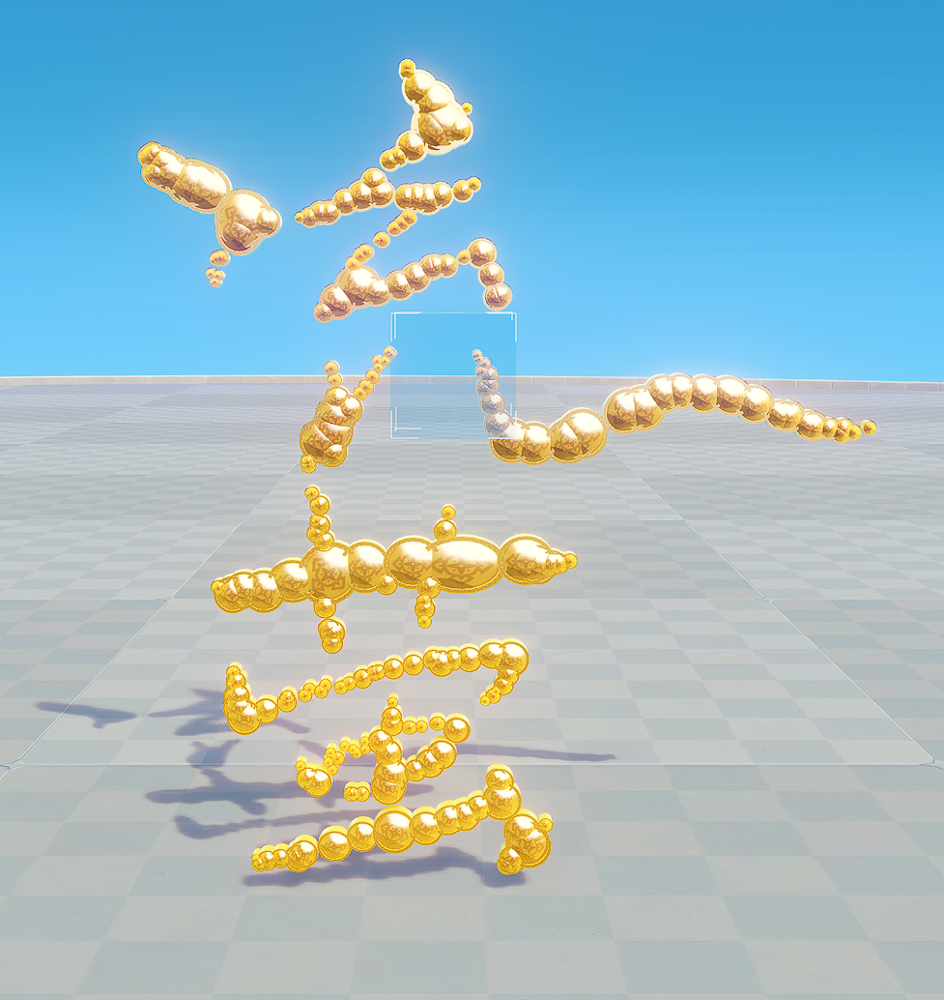

轮廓描边工具

> 本项目代码完全由 AI 生成。

> 本项目可能有部分代码不便开源，相关代码请联系本人获取~

最终技术方案请参考[tech.md](tech.md)

使用方式请参考[user_guide.md](user_guide.md)

## 效果

## TODO
- 支持千星沙箱的更多基础图元。这里冒险币的负载过高，可以换成岩元素徽章。希望后期供各位奇匠选择、配自定义参数。
- 支持 3D/2.5D
- 填充的处理
- 颜色的处理