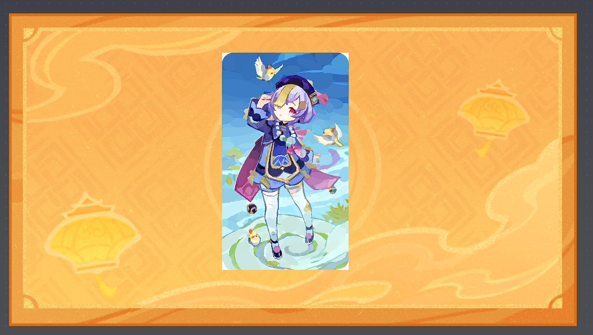
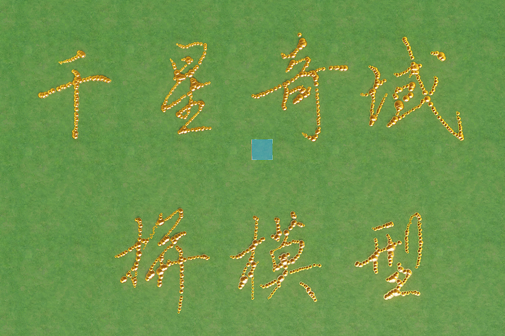

# 千星奇域图片拟合工具

## 图片素材组拟合



参考B站教程 [https://www.bilibili.com/video/BV1kKDyB9EvY](https://www.bilibili.com/video/BV1kKDyB9EvY)

## 装饰物拟合



该功能为本仓库之前的代码，现在修坏了，目前在 [https://qx-shaper.up.railway.app/](https://qx-shaper.up.railway.app/) 部署了可用的[历史commit](https://github.com/1475505/Miliastra-toolbox-primitive-shape/tree/b8045325a71a6b99fa07db8bd721d2ae289fcdec) 版本。


> 本项目代码完全由 AI 生成。

> 本项目可能有部分代码不便开源，相关代码请联系本人获取~

最终技术方案请参考[tech.md](tech.md)

使用方式请参考[user_guide.md](user_guide.md)

## Quick Start

导出gia的构建产物要求在 python 3.13 运行，此部署条件将在后续优化。

安装依赖：

```bash
pip install flask
python server.py
```

若提示primitive的不可用,可自行源码编译. 或准备 `primitive` 可执行文件并放到 `tools/` 目录下:
- 官方仓库：https://github.com/fogleman/primitive/
- 安装 Go 后执行：`go install github.com/fogleman/primitive@latest`
- Windows 放 `tools/primitive.exe`
- Linux/macOS 放 `tools/primitive`
- 没有这个文件时，应用在实际处理图片时会失败。

## 信息

### 圆形

| 元件 | ID | 大小 |
| :--- | :--- | :--- |
| 冒险币 | 10005009 | 1.0 |
| 雷元素徽章 | 20001281 | 0.3 |
| 火元素徽章 | 20001282 | 0.3 |
| 草元素徽章 | 20001283 | 0.3 |
| 冰元素徽章 | 20001284 | 0.3 |
| 岩元素徽章 | 20001285 | 0.3 |
| 水元素徽章 | 20001286 | 0.3 |
| 风元素徽章 | 20001287 | 0.3 |

### 矩形

| 元件 | ID | 大小 |
| :--- | :--- | :--- |
| 木质箱子 | 20001224 | 1.0 |
| 石质元素立方体 | 20001034 | 5.0 |
| 木质箱子（绿） | 20001237 | 1.5 |
| 木质箱子（蓝） | 20001238 | 1.5 |
| 木质箱子（紫） | 20001239 | 1.5 |
| 石质墙体（黄） | 20001869 | 3.0 |
| 石质墙体（红） | 20001870 | 3.0 |
| 石质墙体（灰） | 20001872 | 3.0 |
| 水质立方体 | 20001874 | 1.0 |
| 通常立方体（奶黄） | 20001875 | 1.0 |
| 坚固立方体（暗蓝） | 20001876 | 1.0 |
| 冰质立方体 | 20001877 | 1.0 |
| 火质立方体 | 20001878 | 1.0 |
| 雷质立方体 | 20001879 | 1.0 |
| 矩形木质矮柜 | 20001082 | 1.0 |
| 积木立方体（木色） | 20001096 | 6.0 |
| 积木立方体（深色） | 20001097 | 6.0 |
| 积木立方体（浅色） | 20001100 | 6.0 |
| 石质天花板（白） | 20002146 | 5.0 |
| 木质天花板（黑） | 20002121 | 5.0 |
| 积木平台（绿） | 10005014 | 5.0 |
## 导出说明

处理完成后，结果页当前提供以下导出选项：

- `导出 SVG`
- `导出 PNG`
- `导出 CSS`
- `导出 GIA`

### SVG

SVG 导出会把当前图元结果转换为矢量图形，主要包含：

- `ellipse`
- `rect`
- `polygon`

并保留以下信息：

- 位置
- 尺寸
- 旋转
- 透明度
- 颜色

如果当前结果不是透明背景，导出的 SVG 会自动补一个白色背景。

### PNG

PNG 导出的是当前结果页画布中的最终渲染结果，适合直接预览、分享和存档。

### CSS

CSS 导出适合前端集成，但它不是“只放一个 css 文件就能直接还原结果”的格式。

导出的 CSS 会包含：

- `.shaper-container`
- `.shaper-element`
- `.shaper-element.shaper-e0 ~ .shaper-element.shaper-eN`

使用时通常至少需要一个容器节点：

```html
<div class="shaper-container"></div>
```

然后再用 JavaScript 补齐对应数量的子节点，例如：

```js
const container = document.querySelector('.shaper-container');
for (let i = 0; i < elementCount; i += 1) {
  const node = document.createElement('div');
  node.className = 'shaper-element shaper-e' + i;
  container.appendChild(node);
}
```

为了方便使用，导出的 CSS 文件头部已经附带 `HTML + JavaScript` 的示例注释。

### GIA

超限模式。

## TODO
- 详见部署后网页


