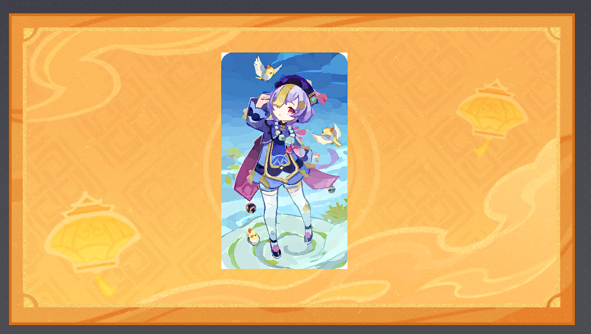
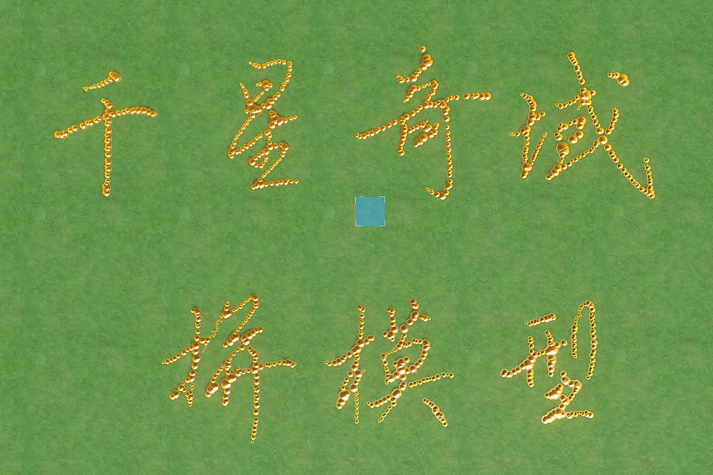

# 千星奇域图片拟合工具

## 图片素材组拟合



参考B站教程 [https://www.bilibili.com/video/BV1kKDyB9EvY](https://www.bilibili.com/video/BV1kKDyB9EvY)

## 装饰物拟合



该功能为本仓库之前的代码，现在修坏了，目前在 [https://qx-shaper.up.railway.app/](https://qx-shaper.up.railway.app/) 部署了可用的[历史commit](https://github.com/1475505/Miliastra-toolbox-primitive-shape/tree/b8045325a71a6b99fa07db8bd721d2ae289fcdec) 版本。


> 本项目代码完全由 AI 生成。

> 本项目可能有部分代码不便开源，相关代码请联系本人获取~

最终技术方案请参考[tech.md](tech.md)

使用方式请参考[user_guide.md](user_guide.md)

## 功能概览

- **图片素材组拟合（填充模式）**：用椭圆、矩形、三角形在区域内随机优化拟合，适合立绘、图标、场景图。
- **装饰物拟合（轮廓模式）**：沿轮廓路径行走排列椭圆、矩形，适合描边与装饰线条。
- **本地模式**：在上传页开启后，拟合在浏览器内用 WebAssembly 完成，图片不上传服务端；仅支持填充模式、单图处理。
- **导出**：素材组资产（超限 / 经典模式 GIA）、客户端脚本（Lua）、可继续编辑的数据（JSON / CSS / SVG / PNG）。
- **GIA 工具**：超限 ↔ 经典模式互转，以及素材组 GIA 转 Lua 绘制脚本。

## Quick Start

导出gia的构建产物要求在 python 3.13 运行，此部署条件将在后续优化。

安装依赖：

```bash
pip install -r requirements.txt
python server.py
```

CLI 直接导出 GIA（支持 `--gia-mode overlimit/classic`）：

```bash
python server.py --cli --input demo.png --gia-mode classic --output output.gia
```

CLI 直接导出 Lua 客户端绘制脚本：

```bash
python server.py --cli --input demo.png --export lua --output output.lua
```

若提示primitive的不可用,可自行源码编译. 或准备 `primitive` 可执行文件并放到 `tools/` 目录下:
- 官方仓库：https://github.com/fogleman/primitive/
- 安装 Go 后执行：`go install github.com/fogleman/primitive@latest`
- Windows 放 `tools/primitive.exe`
- Linux/macOS 放 `tools/primitive`
- 没有这个文件时，应用在实际处理图片时会失败。

## 信息

### 圆形

| 元件 | ID | 大小 |
| :--- | :--- | :--- |
| 冒险币 | 10005009 | 1.0 |
| 雷元素徽章 | 20001281 | 0.3 |
| 火元素徽章 | 20001282 | 0.3 |
| 草元素徽章 | 20001283 | 0.3 |
| 冰元素徽章 | 20001284 | 0.3 |
| 岩元素徽章 | 20001285 | 0.3 |
| 水元素徽章 | 20001286 | 0.3 |
| 风元素徽章 | 20001287 | 0.3 |

### 矩形

| 元件 | ID | 大小 |
| :--- | :--- | :--- |
| 木质箱子 | 20001224 | 1.0 |
| 石质元素立方体 | 20001034 | 5.0 |
| 木质箱子（绿） | 20001237 | 1.5 |
| 木质箱子（蓝） | 20001238 | 1.5 |
| 木质箱子（紫） | 20001239 | 1.5 |
| 石质墙体（黄） | 20001869 | 3.0 |
| 石质墙体（红） | 20001870 | 3.0 |
| 石质墙体（灰） | 20001872 | 3.0 |
| 水质立方体 | 20001874 | 1.0 |
| 通常立方体（奶黄） | 20001875 | 1.0 |
| 坚固立方体（暗蓝） | 20001876 | 1.0 |
| 冰质立方体 | 20001877 | 1.0 |
| 火质立方体 | 20001878 | 1.0 |
| 雷质立方体 | 20001879 | 1.0 |
| 矩形木质矮柜 | 20001082 | 1.0 |
| 积木立方体（木色） | 20001096 | 6.0 |
| 积木立方体（深色） | 20001097 | 6.0 |
| 积木立方体（浅色） | 20001100 | 6.0 |
| 石质天花板（白） | 20002146 | 5.0 |
| 木质天花板（黑） | 20002121 | 5.0 |
| 积木平台（绿） | 10005014 | 5.0 |

## 导出说明

处理完成后，结果页左侧按用途分组提供以下导出（带「复制」的格式可直接复制到剪贴板）：

| 分组 | 导出 | 用途 |
| :--- | :--- | :--- |
| 素材组资产 | 超限模式 GIA / 经典模式 GIA | 作为图片素材组导入游戏 |
| 客户端脚本 | Lua（可复制） | 挂到客户端容器即可在游戏中绘制 |
| 进一步编辑 | JSON（可复制）/ CSS（可复制）/ SVG / PNG | 继续编辑或存档预览 |

此外，上传页面还提供两个独立工具：

- **GIA 模式转换**：超限模式 GIA → 经典模式 GIA，或经典模式 GIA → 超限模式 GIA
- **素材组 GIA 转 Lua 绘制脚本**（超限模式）：把已有素材组直接转成 Lua，可下载或复制

### JSON

JSON 导出包含全部图元的坐标、尺寸、旋转、透明度与颜色，适合作为再次导入或其他工具链的中间数据。

### SVG

SVG 导出会把当前图元结果转换为矢量图形，主要包含：

- `ellipse`
- `rect`
- `polygon`

并保留以下信息：

- 位置
- 尺寸
- 旋转
- 透明度
- 颜色

如果当前结果不是透明背景，导出的 SVG 会自动补一个白色背景。

### PNG

PNG 导出的是当前结果页画布中的最终渲染结果，适合直接预览、分享和存档。

### CSS

CSS 导出适合前端集成，但它不是“只放一个 css 文件就能直接还原结果”的格式。

导出的 CSS 会包含：

- `.shaper-container`
- `.shaper-element`
- `.shaper-element.shaper-e0 ~ .shaper-element.shaper-eN`

使用时通常至少需要一个容器节点：

```html
<div class="shaper-container"></div>
```

然后再用 JavaScript 补齐对应数量的子节点，例如：

```js
const container = document.querySelector('.shaper-container');
for (let i = 0; i < elementCount; i += 1) {
  const node = document.createElement('div');
  node.className = 'shaper-element shaper-e' + i;
  container.appendChild(node);
}
```

为了方便使用，导出的 CSS 文件头部已经附带 `HTML + JavaScript` 的示例注释。

### GIA

支持导出**超限模式**和**经典模式**两种 GIA 格式。结果页可直接选择对应按钮下载；若需要批量转换已有 GIA 文件，可使用上传页面的「GIA模式转换」工具。

### Lua（客户端绘制脚本）

Lua 导出把拟合结果转成一份可直接挂进游戏的客户端绘制脚本：每个图元实例化一个图片控件，矩形 / 圆形 / 三角形分别对应静态图片 `100001` / `100002` / `100003`，位置、旋转、颜色与透明度按拟合结果设置。脚本头部自带同一份使用说明。

使用前必填 `IMAGE_PREFAB_ID`：

1. 准备一个客户端**图片**控件，设为「仅存为模板」，关闭模板遮罩 / 羽化。
2. 把脚本里的 `IMAGE_PREFAB_ID = 0` 改成该控件的**控件模板索引 ID**（不是图片资产 ID）；只需填这一处，脚本会自动按图元类型切换图片。
3. 把脚本作为客户端脚本挂到一个**专用空客户端容器节点**——不要挂在已有界面的根节点上，脚本会设置该节点尺寸；进入运行预览后在 `OnStart` 绘制，不要移到 `OnInit`。`OnDestroy` 会自动清理，重复进入会先清理再重建。

可选参数：`BASE_SCALE`（整体缩放）、`OFFSET_X/Y`（平移，Y 向上）、`SKIP_BACKGROUND`（跳过背景图元）、`FIT_TO_CANVAS`（超出画布自动缩小）。每个图元都会创建一个控件，控件容量与真机显示请在运行预览和真机上确认。

上传页的「素材组 GIA 转 Lua 绘制脚本」是另一条通路：直接把已有素材组转成脚本，沿用素材组里的图片资产与布局（支持键鼠布局、颜色、透明度与层序；文本、嵌套组、动态图片需先转成单层图片）。

## TODO
- 详见部署后网页


